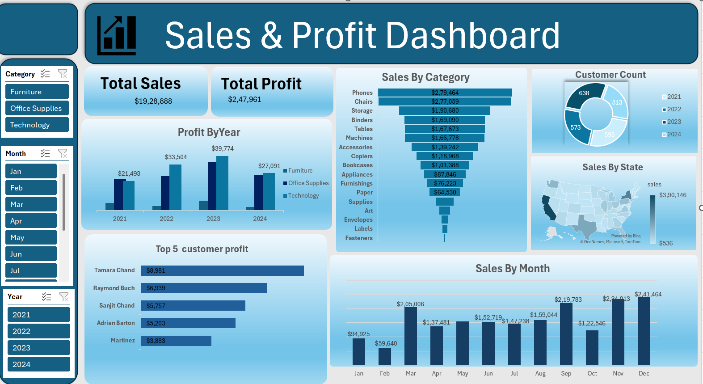

# Sales and Profit Dashboard

The Sales and Profit Dashboard is an interactive analytics tool designed to visualize and monitor sales performance, profit margins, and key business metrics. This dashboard helps businesses make data-driven decisions by providing insights into sales trends, profitability, and product performance.

## Tools Used
- Microsoft Excel
- Pivot Tables
- Charts
- Data Cleaning
- Dashboard Creation

## Dashboard Preview

## Dashboard Preview

## Skills Demonstrated
- Data Cleaning
- Data Analysis
- Dashboard Creation
- Business Insights

##Features

Sales Analysis: Track total sales, monthly sales trends, and category-wise performance.

Profit Insights: Analyze profit margins and identify high-performing products or regions.

Interactive Filters: Filter data by date range, region, or product category for detailed insights.
